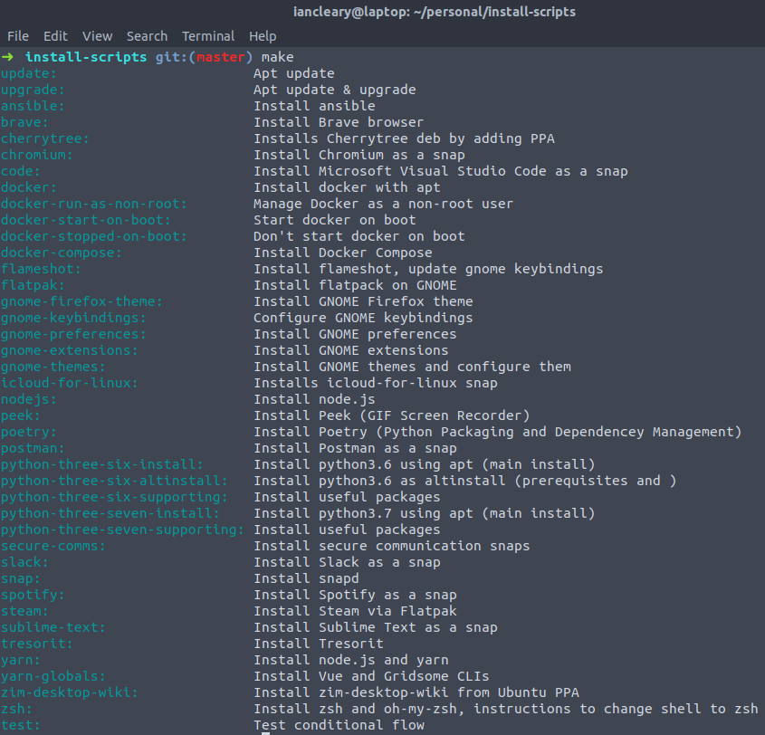
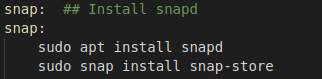
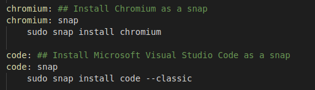
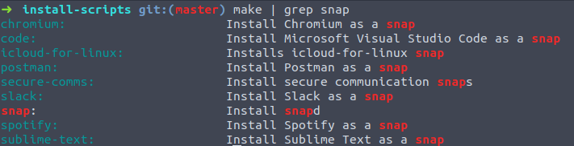

# Ubuntu Laptop and Desktop Setup

I wanted to document how I setup my computers that I use as daily drivers.

## History of my setup

My progression has been as follows:

* found bash script on the internet
* customized bash script for my own needs - wanted to run individual portions of the bash script
* learned about Makefiles and Ansible about the same time
* decided Ansible was more than required (still thinking about this one)

## Getting Started

### Clone the repo

```bash
mkdir ~/personal
git clone git@github.com:iancleary/install-scripts.git ~/personal
cd ~/personal/install-scripts
```

### Inspect the targets

```bash
make
```



Note: The shell is zsh with the `git` plugin from `oh-my-zsh`. See the make targets for scripts to install each of these.

## What I like about Makefiles

### Self documenting Makefile Source

```bash
help:
# http://marmelab.com/blog/2016/02/29/auto-documented-makefile.html
# adds anything that has a double # comment to the phony help list
	@grep -E '^[a-zA-Z_-]+:.*?## .*$$' $(MAKEFILE_LIST) | awk 'BEGIN {FS = ".:*?## "}; {printf "\033[36m%-30s\033[0m %s\n", $$1, $$2}'
```

### Dependencies between targets

I've really enjoyed how you can specify targets to be run before your current target.  

One main different between Makefiles and Ansible will be that Ansible will inspect the current state of the system before taking action.  Makefile targets that call other targets should be considered more of a sequencing.

> Directly, all dependencies are evaluated, but not guaranteed to be in order.

SWCarpentry has great [lessons and references on Makefiles](https://swcarpentry.github.io/make-novice/reference.html), so I would guide you there.

#### Snap install example

Snap target showing how to install `snapd` with `apt`.



Targets requiring the snap target be run **first**!



All my targets with snap



## Current vs. Future Needs

In the above examples and my use cases, the efficiency gain is not having to track down the installation scripts repeatedly from across the internet.  I find the make dependency syntax and the self documenting help bash script to be sufficient for my current needs.

For cases where order and efficiency matter, I would use Ansible.

> Please see the next page for how I setup my build and web servers using Ansible.
